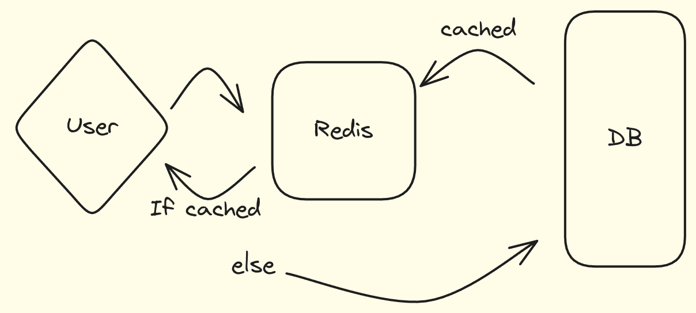

# Redis 

## What is Redis?

Redis is an open-source in-memory data structure store that can be used as a database, cache, and message broker. It supports various data structures such as strings, lists, sets, sorted sets, hashes, bitmaps, hyperloglogs, and geospatial indexes with radius queries. Redis has built-in replication, Lua scripting, LRU eviction, transactions, and different levels of on-disk persistence, and provides high availability via Redis Sentinel and automatic partitioning with Redis Cluster.

## E.g Caching : 



### Key features of Redis:

1. **In-memory data store**: Redis stores data in memory, which allows for fast read and write operations.
2. **Data structures**: Redis supports various data structures such as strings, lists, sets, sorted sets, hashes, bitmaps, hyperloglogs, and geospatial indexes.
3. **Persistence options**: Redis provides different levels of on-disk persistence, allowing data to be saved to disk for durability.
4. **Replication**: Redis supports master-slave replication, allowing data to be replicated across multiple nodes for fault tolerance and scalability.
5. **High availability**: Redis Sentinel provides high availability by monitoring Redis instances and performing automatic failover in case of node failures.
6. **Partitioning**: Redis Cluster allows data to be partitioned across multiple nodes, enabling horizontal scaling of Redis.
7. **Lua scripting**: Redis supports Lua scripting, allowing users to write custom scripts for complex operations.
8. **Transactions**: Redis supports transactions, allowing multiple commands to be executed as a single atomic operation.
9. **Pub/Sub messaging**: Redis supports publish/subscribe messaging patterns, enabling real-time communication between clients.
10. **Built-in commands**: Redis provides a rich set of built-in commands for data manipulation, querying, and administration.

### Example Use Cases:

1. **Caching**: Storing frequently accessed data in memory to reduce latency and improve application performance.
2. **Real-time analytics**: Analyzing real-time data such as user interactions, logs, and metrics to gain insights and make data-driven decisions.
3. **Pub/Sub messaging**: Building real-time chat applications, notifications, and event-driven architectures using publish/subscribe messaging patterns.
4. **Rate limiting**: Implementing rate limiting mechanisms to control the rate of incoming requests and prevent abuse.
5. **Session storage**: Storing session data for web applications to manage user sessions efficiently and securely.

### Resources:

- [Redis Documentation](https://redis.io/documentation)
- [Redis Commands Reference](https://redis.io/commands)
- [Redis Data Types](https://redis.io/topics/data-types)

### Conclusion:

Redis is a versatile and powerful in-memory data store that can be used for a wide range of use cases, including caching, real-time analytics, pub/sub messaging, rate limiting, and session storage. Its rich set of features, data structures, and persistence options make it a popular choice for building high-performance and scalable applications. By leveraging Redis, developers can improve the speed, reliability, and efficiency of their applications while enabling real-time data processing and communication.


- Setting up Redis on Docker

```bash
 docker run -d --name redis-stack -p 6379:6379 -p 8001:8001 redis/redis-stack:latest 
```

- Connecting to Redis using Redis CLI

```bash
docker exec -it <container_id> bash
```

### Data types in Redis

1. **Strings**: A string is a sequence of characters that can be used to store text, numbers, or binary data. Strings are the simplest data type in Redis and can be manipulated using various commands such as `SET`, `GET`, `INCR`, `DECR`, and `APPEND`.

- SET
```bash
set key value
eg : set name "John Doe"
```
- SETNX
```bash
setnx key value
eg : setnx name "Jane Doe"
```
- GET
```bash
get key
eg : get name
```
- INCR
```bash
incr key
eg : 
```

2. **List** : Redis lists are linked lists of string values. Redis lists are frequently used to:
- Implement stacks and queues.
- Build queue management for background worker systems.

### Basic commands
- LPUSH adds a new element to the head of a list; RPUSH adds to the tail.
- LPOP removes and returns an element from the head of a list; RPOP does the same but from the tails of a list.
- LLEN returns the length of a list.
- LMOVE atomically moves elements from one list to another.
- LTRIM reduces a list to the specified range of elements.


